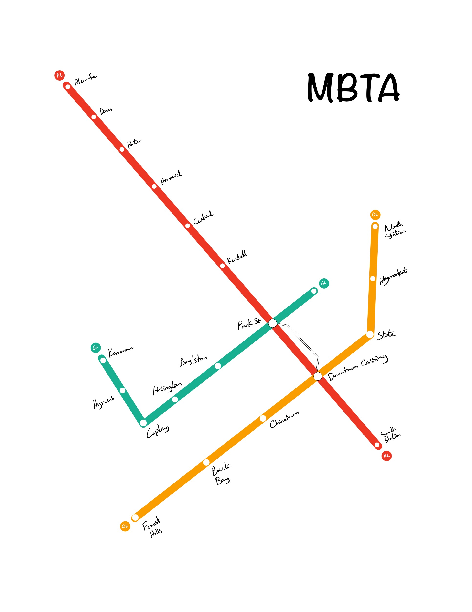
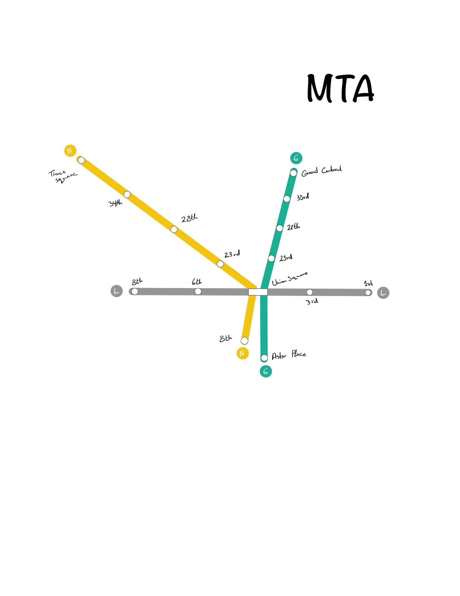

# Homework: Ruby Array and Hash Homework

## Objectives:

- Apply your knowledge of ruby to solve a real world problem.
- Get really good at array manipulation.

## Activity

Create a program that models a subway system.

The program takes the line and stop that a user is getting on at and the line and stop that user is getting off at and prints the journey and the total number of stops for the trip in the console:

There are 3 subway lines:

**Red line**
- South Station
- Park Street
- Kendall
- Central
- Harvard
- Porter
- Davis
- Alewife

**Green line** 
- Government Center
- Park Street
- Boylston
- Arlington
- Copley
- Hynes
- Kenmore

**Orange line**
- North Station
- Haymarket
- Park Street
- State
- Downtown Crossing
- Chinatown
- Back Bay
- Forest Hills

All 3 subway lines intersect at Park Street, but there are no other intersection points.

### Goal

Tell the user the number of stops between stations.

```rb
stops_between_stations('Red', 'Alewife', 'Red', 'Alewife') # 0
stops_between_stations('Red', 'Alewife', 'Red', 'South Station') # 7
stops_between_stations('Red', 'South Station', 'Green', 'Kenmore') # 6
```

### Bonus

Tell the user the number of stops between stations AND the stops IN ORDER that they will pass through or change at.
```rb
stops_between_stations('Red', 'South Station', 'Green', 'Kenmore') 
# "You must travel through the following stops on the Red line:"
# "South Station and Park Street"
# "Change at Park Street."
# "Your trip continues through the following stops on Green Line:" 
# "Boylston, Arlington, Copley, Hines, and Kenmore."
# "7 stops in total."
```

### Double Bonus

Use `get` to allow the user to input their start line, start station, end line, and end station.

## MTA Puzzle (Super Optional Bonus)

- Create a program that models a simple subway system.

- The program takes the line and stop that a user is getting on at and the line and stop that user is getting off at and prints the journey and the total number of stops for the trip in the console:

```rb
planTrip("N", "Times Square", "6", "33rd") # This is only a suggested method name and signature.

# shows output similar to this:
# "You must travel through the following stops on the N line: 34th, 28th, 23rd, Union Square."
# "Change at Union Square."
# "Your journey continues through the following stops: 23rd, 28th, 33rd."
# "7 stops in total."
```

- There are 3 subway lines:
  - The N line has the following stops: Times Square, 34th, 28th, 23rd, Union Square, and 8th (Yellow)
  - The L line has the following stops: 8th, 6th, Union Square, 3rd, and 1st (Grey)

  - The 6 line has the following stops: Grand Central, 33rd, 28th, 23rd, Union Square, and Astor Place. (Green)

  - All 3 subway lines intersect at Union Square, but there are no other intersection points. (For example, this means the 28th stop on the N line is different than the 28th street stop on the 6 line, so you'll have to differentiate this when you name your stops in the arrays.)

- Tell the user the number of stops AND the stops IN ORDER that they will pass through or change at.

### MBTA Lines Drawing



### MTA Lines Drawing

